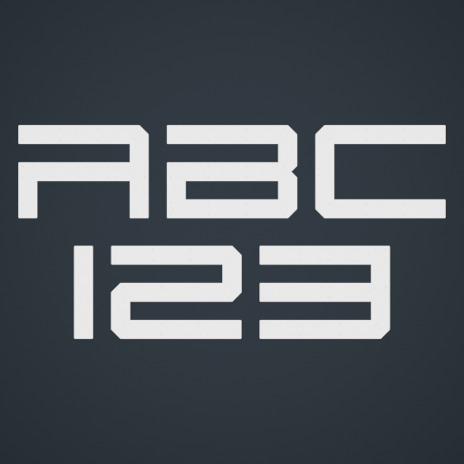
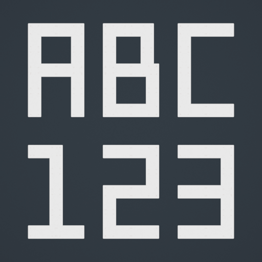
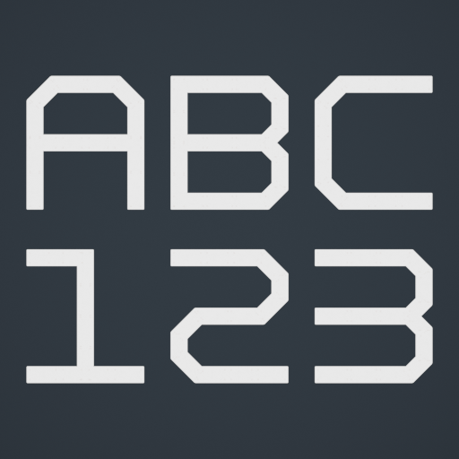
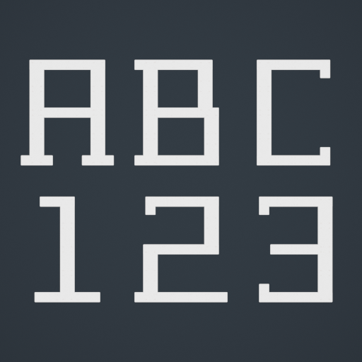
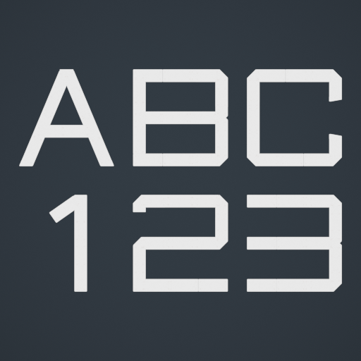

# NMS Text Generator for Blender Base Builder

Build editable No Man's Sky lettering from native Flat Panels or Storage Panel backs, with five
panel-lettering styles, visual previews, automatic style switching and right-click editing.

An independent Blender add-on with its own **NMS Text** sidebar. It calls
No Man's Sky Base Builder's native-part functions; it does not modify that add-on.

## Download and install

Download the installable **NMS_Text_Generator_<version>.zip** from
[Releases](https://github.com/slipperystickers/nms-text-generator/releases/latest).
Do **not** install GitHub's automatically generated Source code ZIP.

1. Install and enable the compatible No Man's Sky Base Builder first.
2. In Blender, open **Edit > Preferences > Add-ons > menu > Install from Disk**.
3. Select the add-on ZIP without extracting it, then enable **NMS Text Generator for Blender Base Builder**.
4. After an update, save your work and restart Blender.
5. Hover over the 3D Viewport, press **N**, and open the **NMS Text** tab.

Tested on **Blender 5.1.2 / Windows**, with the **18.0.8 Base Builder installation**
used during development. The dependency must expose `builder_v2.add_part`,
`Part`, `BUILDER`, `get_asset_index`, and the high-resolution `BUILDFLATPANEL`
asset (`STORAGEPANEL` is also required for the Storage option). Compatibility with other builds is not yet established. The plugin reports
missing dependency/API/assets instead of generating substitute geometry.

## Quick start

1. Use **Object Mode** and place the **3D Cursor** at the sign's baseline anchor.
2. Enter text, choose a style and **Panel type**, set size/spacing and orientation, then click **Generate New Text**.
3. Leave all panels of that sign selected and choose another style or panel type to regenerate automatically.
4. Later, select any one panel and right-click **Edit NMS Text**. Confirm with **OK**; Cancel changes nothing.
5. Use **Select Control** to move, rotate or uniformly scale the whole sign.
6. Save your `.blend` to keep the text editable. Use **Export Selected Text JSON** for native-part export.

**[Read the complete User Guide](USER_GUIDE.md)** — installation, every setting,
multiline text, mounting, colours, re-editing, examples, export and troubleshooting.

## Five panel-lettering styles

| Boundary | Bulkhead | Orbit | Forge |
| :---: | :---: | :---: | :---: |
|  |  |  |  |
| Wide technical lettering | Squared utility lettering | Chamfered geometric lettering | Rectangular slab serifs |

### Vector (new in public release 1.6.0)



Orbitron-inspired ship lettering with custom flat-capped diagonals, a softer D,
triangular A, corrected 4 and upright 7. Standard 4.9-unit character cells and
0.64-unit strokes at the native five-unit height; I uses a compact 0.64-unit
advance with the normal letter gap, 1 is centered, and Q's tail
extends beyond its body. Uses 4–32 panels per character (626 for A-Z plus 0-9).
The optimized title `TYNDUSTRIAL ASTRONAUTICS` uses 367 panels, including the
corrected C with inward-facing terminals. All exposed faces remain parallel.
Small panels approximate pointed ends; this is not an exact outline trace.

The picker uses the familiar label **Font**, but these are predefined NMS part
placements, not installable TTF/OTF font files. All styles support A-Z and 0-9.
Lowercase converts to uppercase; type `\n` for a new line. No punctuation or
arbitrary font tracing is included. See [credits and provenance](NOTICE.md).

**Panel type** changes the native item, not the font design or part count.
Storage Panels expose their plain back face; Flat Panels expose their decorated
front face. Both use uniform scaling and closely matched footprints. There is
no in-game evidence yet that one loads faster or more reliably than the other.

## Editing and safety

- Each sign has its own collection, parent control and saved text settings.
- Auto-switch defaults **ON**, works on one fully selected sign, and supports undo.
- Partial/mixed selections do not auto-rebuild. Right-click editing works from one panel.
- Rebuilding preserves the control transform, but replaces manual edits to generated panels.
- Panels retain their native proportions. Do not stretch, mirror, shear or join them.
- Only the front silhouette is intended to show; bury the rear geometry in a backing surface.
- The generator's 3,000-part limit is a safety guard, not a statement of NMS upload limits.
- It never writes live game saves. A JSON round trip does not preserve editable text metadata.

## Development

Requires Python 3.10+ for the standalone layout tests and packaging script:

```sh
python -m unittest discover -s tests -v
python scripts/build_release.py
```

The installer ZIP and SHA-256 checksum are created in `dist/`. No network access
or third-party Python packages are required for these commands.

For the native integration tests, use Blender with the compatible Base Builder
installed. This opens a separate factory-startup/background session:

```sh
blender --background --factory-startup --python tests/blender_smoke.py
blender --background --factory-startup --python tests/blender_panels.py
blender --background --factory-startup --python tests/zip_smoke.py
```

Use `-- --installed` to test the installed module instead of this checkout.
Blender may return exit code 0 even when a script fails: check for the final
`ALL_NATIVE_TESTS_PASSED`, `ALL_PANEL_SWITCH_TESTS_PASSED`, and
`CLEAN_ZIP_INSTALL_PASSED` messages respectively. Build the ZIP before running
`zip_smoke.py`. Never run these tests in a working scene.

## License and credits

Plugin code is **GPL-3.0-or-later**; see [LICENSE](LICENSE) and [NOTICE](NOTICE.md).
The GPL notice does not license Hello Games assets or claim rights in referenced
third-party typeface designs. No game meshes, textures, Base Builder source,
TTF/OTF files, or packed Blender files are distributed here.

Thanks to **DjMonkey** for No Man's Sky Base Builder. This is an unofficial
community project, not endorsed by Hello Games, Blender Foundation, or Base Builder's author.

Blender generation/export and editing workflows have been tested. In-game,
unmodded multiplayer, console, and upload-limit behavior are not certified.
